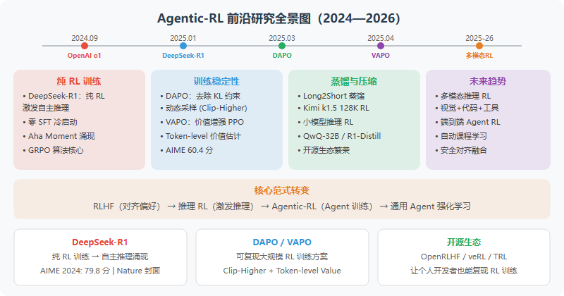

# PPO、GRPO、DPO、GSPO 对比

> 主题：LLM 对齐与 Agentic-RL 中常见策略优化算法的区别、优缺点和选型建议。  
> 资料来源见文末。

## 1. 一句话总结

| 算法 | 核心思路 | 最适合的场景 |
| --- | --- | --- |
| PPO | 用在线采样、奖励模型/Critic、Clip 和 KL 约束做近端策略更新 | 通用 RLHF、需要在线探索且资源充足 |
| DPO | 把偏好对齐转成离线监督学习，不训练 Reward Model 和 Critic | 已有高质量 chosen/rejected 偏好数据，目标是稳定对齐 |
| GRPO | 对同一 prompt 采样一组回答，用组内相对奖励替代 Critic | 数学、代码、可验证奖励等需要在线探索的 LLM RL |
| GSPO | 在 GRPO 基础上把重要性采样从 token 级提升到序列级 | 大模型、长序列、MoE 模型，尤其关注训练稳定性 |

## 2. 核心差异总览

| 维度 | PPO | DPO | GRPO | GSPO |
| --- | --- | --- | --- | --- |
| 训练范式 | 在线 RL | 离线偏好学习 | 在线 RL | 在线 RL |
| 数据来源 | 采样回答 + 奖励模型/奖励函数 | prompt + chosen/rejected 偏好对 | 每个 prompt 采样 G 个回答 + 奖励函数 | 同 GRPO |
| 主要模型 | Policy + Critic + Reference，通常还需要 Reward Model | Policy + Reference | Policy + Reference，无 Critic | Policy + Reference，无 Critic |
| 优势估计 | GAE，依赖 Critic | 无显式优势函数，隐式比较 chosen/rejected | 组内标准化优势 | 组内标准化优势 |
| 更新约束 | token 级 PPO Clip + 显式 KL | 损失中的隐式 KL，β 控制约束强度 | token 级 Clip + 通常显式 KL | 序列级 Clip，显式 KL 可省略 |
| 重要性采样粒度 | token 级 | 不使用在线重要性采样 | token 级 | 序列级 |
| 显存/工程成本 | 高 | 低到中 | 中 | 中，且旧策略概率计算更容易简化 |
| 探索能力 | 强 | 弱，受限于离线数据 | 强 | 强 |
| 稳定性 | 中等，依赖 Critic 和超参数 | 高，接近监督学习 | 高于 PPO，但 token 级比率仍有噪声 | 更高，尤其适合长序列和 MoE |

## 3. PPO

PPO（Proximal Policy Optimization）的目标是在不让策略更新过大的前提下，提升高奖励动作的概率、降低低奖励动作的概率。典型目标包含 PPO Clip、KL 惩罚和 Critic 损失：

```text
L = -E[min(r_t A_t, clip(r_t, 1-ε, 1+ε) A_t)]
    + β * D_KL(π_θ || π_ref)
    + c_v * L_value
```

其中 `r_t` 是当前策略相对旧策略的概率比，`A_t` 通常由 Critic 通过 GAE 估计。Clip 控制单步更新幅度，KL 约束当前策略不要偏离 SFT Reference 太远。

**优点**

- 通用性强，不限于语言模型，也适用于更一般的强化学习任务。
- 在线探索能力强，有机会发现离线偏好数据中没有覆盖的新策略。
- 理论和工程生态成熟，是 RLHF 经典方案。
- Critic 可以给出更细粒度的优势估计，对复杂序列决策有帮助。

**缺点**

- 工程复杂，需要维护 Policy、Critic、Reference，实际 RLHF 中还常有 Reward Model。
- 显存和训练成本高，Critic 往往与 Policy 同规模。
- 超参数多，例如 `clip ε`、`KL β`、GAE `λ`、Critic 学习率等。
- Critic 估计误差会传递到 Policy，导致训练不稳定。

## 4. DPO

DPO（Direct Preference Optimization）把 RLHF 中的奖励建模和强化学习步骤合并为一个偏好分类式损失。训练数据是同一个 prompt 下的 `chosen` 和 `rejected`：

```text
L_DPO = -E[log σ(β * log(π_θ(y_w|x) / π_ref(y_w|x))
                - β * log(π_θ(y_l|x) / π_ref(y_l|x)))]
```

直觉是：当前模型相对 Reference，在 chosen 上的概率提升应该大于 rejected。`β` 控制偏离 Reference 的程度。

**优点**

- 训练简单，不需要在线采样、不需要单独训练 Reward Model、不需要 Critic。
- 显存成本较低，主要只需要 Policy 和冻结的 Reference。
- 训练稳定，形式上更接近监督学习。
- 偏好数据可以反复复用，数据效率高。

**缺点**

- 没有在线探索能力，能力上界受偏好数据质量和覆盖范围限制。
- 不能自然利用可执行奖励或环境反馈去发现新策略。
- 对 chosen/rejected 数据质量敏感，错误偏好会被直接学习。
- `β` 过大可能过于保守，过小可能偏离 Reference 并损伤基础能力。

## 5. GRPO

GRPO（Group Relative Policy Optimization）的关键是去掉 PPO 中的 Critic。它对同一个 prompt 采样 G 个回答，分别计算奖励，再用组内均值和标准差做相对优势：

```text
A_i = (r_i - mean(r_1, ..., r_G)) / (std(r_1, ..., r_G) + ε)
```

然后使用类似 PPO 的 Clip 目标和 KL 约束更新策略。它的核心洞察是：在 LLM 场景中，同一个问题的多个候选回答可以互相作为 baseline，因此不必再训练一个 Critic。

**优点**

- 不需要 Critic，显存和训练复杂度明显低于 PPO。
- 保留在线探索能力，适合数学、代码、工具调用等可验证奖励任务。
- 组内标准化降低了奖励尺度影响，不同 reward 的量纲更容易处理。
- 超参数少于 PPO，训练链路更清晰。

**缺点**

- 每个 prompt 要采样 G 个回答，推理采样成本更高。
- 奖励函数设计很关键，奖励区分度不足时组内优势会接近 0，训练信号变弱。
- 仍使用 token 级重要性比率，同一序列内不同 token 的更新幅度可能差异很大。
- 对长序列和 MoE 模型，token 级高方差噪声可能导致不稳定。

## 6. GSPO

GSPO（Group Sequence Policy Optimization）继承 GRPO 的组内相对优势，但把重要性采样从 token 级改为序列级。它对整条回答的 token log ratio 取长度归一化平均，再取指数：

```text
ρ_seq(y_i) = exp((1 / |y_i|) * Σ_t log ρ_{i,t})
```

这样，同一个回答序列中的所有 token 共享同一个 `ρ_seq`，Clip 也作用在序列级，而不是逐 token 裁剪。

**优点**

- 序列内 token 更新幅度一致，梯度噪声更低。
- 对长序列更鲁棒，避免 token 级噪声随长度累积放大。
- 对 MoE 模型更友好，因为可以减少 token 级梯度波动对 Router 的影响。
- 对旧策略概率的精度更不敏感，有机会简化训练/推理基础设施。

**缺点**

- 相比 PPO、DPO、GRPO，GSPO 更加新，生态和实践经验更少。
- Clip `ε` 的量级与 GRPO 不同，通常需要重新调参到更小范围。
- 仍然需要在线采样和奖励函数，不能替代奖励设计本身。
- 对小型 Dense 模型，收益可能不如在大模型/MoE 上明显。

## 7. 选型建议

| 场景 | 推荐算法 | 原因 |
| --- | --- | --- |
| 有大量高质量偏好对，只想做指令遵循/安全对齐 | DPO | 最简单、稳定、成本低 |
| 需要模型通过奖励探索新推理/代码策略 | GRPO 或 GSPO | 保留在线探索能力，不受离线偏好数据上界限制 |
| 资源充足且需要通用 RLHF 基线 | PPO | 通用、成熟，但工程和显存成本高 |
| 小到中等 Dense 模型，奖励函数清晰 | GRPO | 成熟度较高，资源成本低于 PPO |
| 大模型、长链路推理、MoE 训练 | GSPO | 序列级比率更稳定，能降低 token 级噪声 |
| 同时有偏好数据和规则奖励 | DPO + GRPO/GSPO 分阶段 | 先用 DPO 建立对齐基线，再用在线 RL 提升任务能力 |

## 8. 关系脉络

```text
PPO  ->  DPO
 |       去掉在线 RL、Reward Model 和 Critic，换来简单稳定，但失去探索能力
 |
 v
GRPO
去掉 Critic，用组内相对奖励替代，保留在线探索并降低显存成本
 |
 v
GSPO
把 token 级重要性采样提升为序列级，进一步降低方差和训练不稳定
```

可以把四者理解为不同的工程取舍：

- PPO：最完整，但最重。
- DPO：最简单稳定，但不探索。
- GRPO：在成本和探索之间折中。
- GSPO：在 GRPO 基础上继续优化稳定性，尤其面向大模型和 MoE。

## 9. 参考资料

- [DPO 算法原理与代码实现：让 LLM 对齐变得简单](https://yuanchaofa.com/post/hands-on-dpo-direct-preference-optimization)
- [PPO：近端策略优化](https://haozhe-xing.github.io/agent_learning/zh/chapter_agentic_rl/03_ppo.html)
- [GRPO/GSPO：组内相对策略优化与奖励函数设计](https://haozhe-xing.github.io/agent_learning/zh/chapter_agentic_rl/05_grpo.html)
- [图解大模型RLHF系列之：人人都能看懂的PPO原理与源码解读](https://zhuanlan.zhihu.com/p/677607581)
- [跟着 verl 代码学习 PPO 算法流程](https://zhuanlan.zhihu.com/p/1912911365204582526)
- [详解Qwen3-GSPO和DeepSeek-GRPO两大强化学习算法的区别](https://zhuanlan.zhihu.com/p/1932791271363154917)